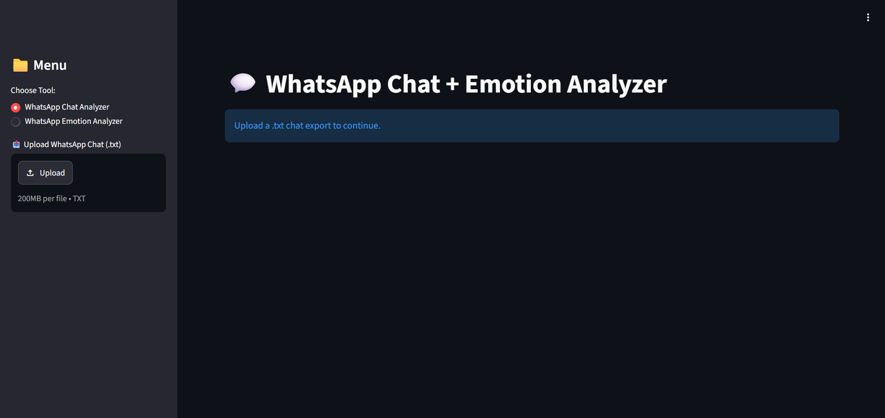
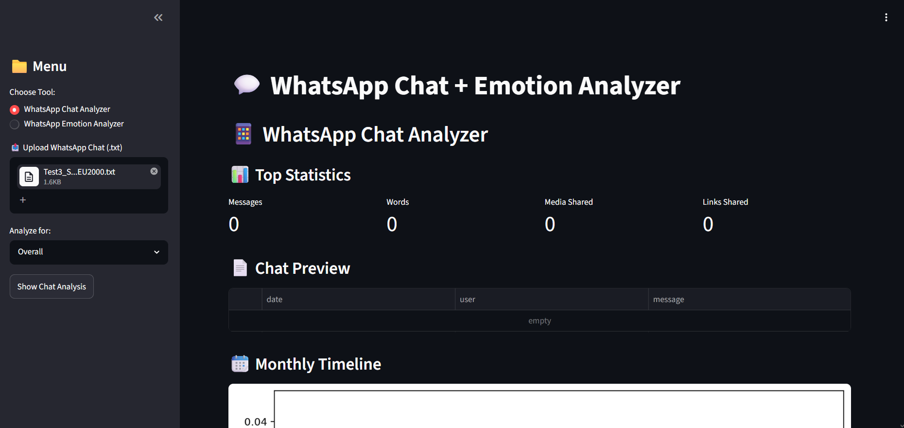

# 💬 WhatsApp Chat Analyzer & Sentiment Detection System

An intelligent analytics platform that automatically processes raw WhatsApp chat exports, transforms unstructured conversations into structured datasets, and generates meaningful insights through data visualization and sentiment analysis.

The system enables users to understand communication patterns, emotional trends, activity levels, and linguistic behavior within WhatsApp conversations.

---

## 🚀 Features

✅ Automatic WhatsApp chat parsing

✅ Chat preprocessing and cleaning

✅ User-wise activity analysis

✅ Message frequency analysis

✅ Daily, weekly, and monthly activity trends

✅ Emoji usage analysis

✅ Word cloud generation

✅ Most common words extraction

✅ URL and media sharing statistics

✅ Sentiment and emotion detection

✅ Interactive visualizations

---

## 🎯 Problem Statement

Raw WhatsApp chat exports are lengthy, unstructured, and difficult to interpret manually.

This project automates the process of:

- Parsing chat exports.
- Structuring conversation data.
- Analyzing communication behavior.
- Detecting emotional trends.
- Generating visual summaries.

The goal is to help users easily understand their communication habits and social interactions.

---

## 🏗️ System Architecture

```text
WhatsApp Chat Export (.txt)
                |
                ↓
      Chat Preprocessing
                |
                ↓
      Data Cleaning & Parsing
                |
                ↓
      Structured Dataset Creation
                |
    ---------------------------------
    |               |               |
Activity      Text Analysis   Sentiment Analysis
Analysis
    |               |               |
    ---------------------------------
                |
                ↓
       Visualization Dashboard
```

---

## 📂 Project Structure

```text
WhatsApp-Chat-Analyzer/
│
├── app.py                        # Main application
├── helper.py                     # Analysis functions
├── preprocessor.py               # Chat preprocessing utilities
├── emotion_model_train.py        # Sentiment model training
├── requirements.txt
├── stop_hinglish.txt             # Stopwords
├── hinglish_sentiment_5000.csv   # Sentiment dataset
├── screenshots/                  # Project screenshots
└── README.md
```

---

## 🛠️ Technology Stack

### Programming Language

- Python

### Libraries

- Pandas
- NumPy
- Matplotlib
- Seaborn
- WordCloud
- Regex
- Emoji
- URLExtract

### Machine Learning

- Scikit-learn
- NLP Techniques
- Sentiment Classification

### Web Framework

- Streamlit / Flask *(whichever you used)*

---

## 📊 Analysis Performed

### User Activity Analysis

- Most active users
- Message counts
- Media sharing statistics

### Time-Based Analysis

- Daily timeline
- Monthly timeline
- Weekly activity
- Heatmaps

### Text Analysis

- Most common words
- Word frequency distribution
- Word clouds

### Emoji Analysis

- Most frequently used emojis
- Emoji distribution

### Sentiment Analysis

The system classifies chat messages into emotional categories and identifies overall conversation sentiment.

Examples:

- Positive 😊
- Neutral 😐
- Negative 😔

---

## 📸 Screenshots

### Dashboard



### Activity Analysis



### Word Cloud


### Sentiment Analysis


### Heatmap


---

## ⚙️ Installation

Clone the repository:

```bash
git clone https://github.com/NejiHyuga55/WhatsApp-Chat-Analyzer.git
```

Move into the project directory:

```bash
cd WhatsApp-Chat-Analyzer
```

Install dependencies:

```bash
pip install -r requirements.txt
```

---

## ▶️ Running the Application

Run the application:

```bash
python app.py
```

or

```bash
streamlit run app.py
```

*(Use whichever command matches your implementation.)*

---

## 📈 Sample Insights Generated

- Most active participant.
- Peak chatting hours.
- Most frequently used words.
- Emoji usage statistics.
- Emotional trends over time.
- Monthly communication patterns.

---

## 🔮 Future Improvements

- Real-time chat analytics.
- Group toxicity detection.
- Relationship health analysis.
- Multilingual sentiment detection.
- Interactive dashboards.
- Exportable PDF reports.

---

## 👥 Contributors

Developed by:

- Hriday Thakur
- Keshav Kumar
- Harsh Agarwal

---

## 🤝 Contribution

Contributions are welcome.

Feel free to fork the repository and submit pull requests.

---

## 📄 License

This project is licensed under the MIT License.

---

## ⭐ Acknowledgements

- Open-source NLP community
- Python ecosystem
- WhatsApp export feature
